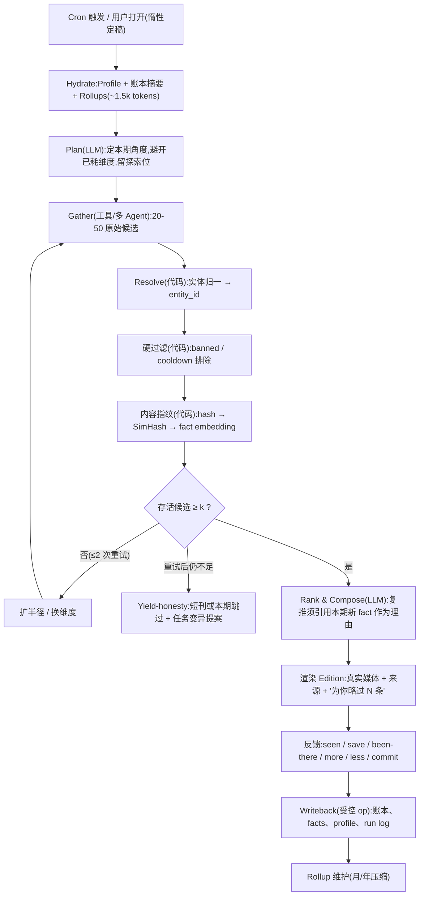

# Recurring Task 产品设计:Feed 消费形态 × 去重与记忆架构

> 针对"订阅式 / Recurring Agent"产品的一份完整设计分析:从产品定位、Feed 组织形态,到实体级/内容级去重与 365 天长时程记忆的系统架构。
> 日期:2026-08-28

---

## 0. TL;DR:十条核心结论

1. **方向成立,但对标错了一半。** Recurring Agent 不是 Netflix/Spotify(无限内容池、纯消费),而是"高质量周刊 + 私人管家":每个 task 每周期的**信息产量是有限的**。因此 cadence 是**上限而不是配额**——系统必须被允许说"本周没有值得你时间的新内容",否则一定滑向注水和重复,信任死亡。
2. **Feed 的正确模型是 Edition(期刊),不是 infinite feed,也不是按 task 分 tab。** 首页 = 时间轴上的合刊(有限、有底、可放心离开);每个 task 沉淀为一个 Library(图鉴/地图/档案),承接长期积累。Tab 分栏会暴露"薄周"并在消费开始前强加导航决策,是错误答案。
3. **积压靠"重新合成",不靠堆积。** 用户一周没打开,不是把 4 期堆在那里,而是在打开时**惰性合成一份 catch-up 期刊**(跨期重新摘要、过期内容静默淘汰、仍有效的实体折叠进 Library)。Feed 是任务状态之上的**视图函数**,不是 append-only log。
4. **死循环的机理要先讲清楚:相似度检索天然放大重复。** "别再推 X"是**负向约束**,是集合运算(`NOT IN`),不能用向量检索表达——你越推荐过 Central Park,它的记忆痕迹越强,检索时越靠前。所以实体去重必须做在 harness 的代码层(硬过滤),不能做在 prompt 指令或 embedding 召回里。
5. **架构 = 三层状态 + 一条管线。** Layer 1 实体账本(Entity Ledger,确定性 bookkeeping);Layer 2 内容指纹(URL hash / SimHash / fact-level embedding 三级);Layer 3 编译态记忆(Task Profile + 层级 rollup)。LLM 只负责判断与写作,确定性的排除、冷却、指纹全部由代码执行。
6. **365 天问题的答案:prompt 永远只装"编译后的状态",不装历史。** 账本摘要 + 滚动摘要 + 结构化偏好合计 <2k tokens,与任务年龄无关——第 1 天和第 365 天的单次运行成本相同。这就是长期鲁棒性与 token 效率的同时解。
7. **Vector DB 的裁决:要 embedding,不要专用 Vector DB。** fact 级近重检测需要 embedding,但按 (user, task) 分区后每个分区一年才 ~1k 条向量,pgvector + 暴力余弦即可,ANN 和独立向量库是过度工程。Knowledge graph 在单 task 尺度上只增加仪式感不增加能力,推迟到跨 task 推理阶段再说。
8. **去重不仅要做,还要被看见。** 期刊底部展示"本周为你略过了 7 个你去过/看过的内容";"关于你,我记住了这些"可查看、可删除。去重同时是**信任装置**——这是订阅产品的核心资产。
9. **指标反着定。** North star 是"每周有效期刊率"(打开且产生保存/点击/行动),明确**不优化时长**、不做无限下滑、不做 streak。这是与 engagement feed 在机制上划清界限的地方,也是"time well spent"从口号变成约束的地方。
10. **"习惯养成后用户自己 schedule"这个假设要修正。** 自主 scheduling 长期会是少数派行为(参照 RSS/播客订阅的转化率)。"从对话与行为中识别 standing intent → 一键确认订阅"不是冷启动的过渡手段,而是**永久的主循环**。Chat 与 Recurring 不是两个平行形态,Chat 是 Recurring 的采集与配置界面。

---

## 1. 产品定位:两种 Agent 形态的判断

### 1.1 这个判断为什么成立

Ad-hoc(walk-in)与 Recurring(subscription)的二分,底层对应的是两类需求形态:

- **即时需求(transaction)**:一次性、有明确 query、用完即走。Chat 产品已充分覆盖,且趋于同质化——stateless 的问答没有转移成本。
- **长期需求(standing intent)**:持续存在、用户往往说不出口、需要被识别。"保持了解 X"、"每周帮我想 Y"、"盯着 Z 有变化告诉我"。

Recurring 的三个结构性优势:

1. **Push 经济学**:Chat 是 pull,每次会话都要消耗用户的激活能量;订阅是 push,是习惯性留存(DAU)真正的来源。
2. **价值复利**:每次运行都在积累对用户的理解(偏好、已看过、去过、反馈),第 52 周的输出应该显著好于第 1 周。stateless chat 没有这个曲线。
3. **转移成本**:积累的 per-user 状态(账本、偏好、历史)是竞品无法复制的。Feed UI 一个季度就能抄走,一年的用户状态抄不走。

市场也在验证这个方向:ChatGPT Pulse(每日 proactive briefing 卡片流,2025 年发布)、Gemini Scheduled Actions、Perplexity Tasks / Computer 的 Scheduled Tasks 都已落地。这既是方向确认,也是竞争警报(见 1.5)。

### 1.2 与 Netflix/Spotify 类比的关键差异:信息产量有限

Netflix/Spotify 的池子相对无限、消费是开放式的;而一个 recurring task 每周期的**真实信息增量是有限且波动的**。"每周推荐周末去处"在 Santa Clara 方圆 10 英里内,公园就那么多;"关注某个小众领域的进展"有的周就是没有进展。

由此推出本文档最重要的一条产品纪律:

> **Cadence 是上限,不是配额。**
> 调度只决定"最多多久看一次",不承诺"每次一定有货"。当真实增量不足时,系统的正确行为是出短刊、降频、或明确说"本周略过"——而不是注水。用户识别出注水(重复、泛泛、AI 腔)的那一刻,订阅信任就开始死亡,而信任是这类产品唯一的资产。优质 newsletter 敢于跳周,这反而是质量信号:"no update is an update"。

用户提出的去重问题,本质是这条纪律的工程投影:**去重系统的目标不是"永不重复",而是保证"每个卡片的边际信息量 > 0"。**(重复实体 + 新理由 = 好内容,见 5.1。)

### 1.3 需要修正的一个假设:用户自主 schedule 长期是少数

"起初 proactive suggest,习惯养成后用户自己 schedule"——前半句对,后半句大概率不会发生在大盘用户身上。自己配置 standing query 是 power-user 行为:RSS 之所以停留在小众,正是因为它要求用户做自己的策展人;播客用户里主动添加 RSS 源的比例同样极低。ChatGPT Tasks 类功能的实际使用数据也指向同一结论。

设计含义:**"识别 → 建议 → 一键确认"是永久主循环,不是冷启动脚手架。**

- 信号源:对话历史(同类问题问了 3 次)、连接的数据源(日历、邮件、位置)、feed 内行为(反复保存某类内容)。
- 转化时机:在**用户刚刚表达了第 N 次同类需求的当下**弹出建议("你三周里问了三次周末去哪——要不要我每周五帮你准备好?"),而不是在设置页等用户来。
- 由此,Chat 和 Recurring 的关系不是两个平行产品,而是:**Chat 是意图采集与任务配置的 console,Recurring 是价值交付的主体。** 每次 ad-hoc 会话都是一次潜在的订阅转化。

### 1.4 任务类型学:后面所有设计的分叉点

三类 recurring task,其内容的**时间语义**完全不同,Feed 策略、过期策略、去重策略都要按类分叉:

| 类型 | 例子 | 时间语义 | 过期行为 | 主要去重维度 |
|---|---|---|---|---|
| **Perishable(时效/可行动)** | 每周周末去处、本周活动、今晚吃什么 | 到期即作废(周日晚) | 静默过期;仍有效的**实体**折入 Library | 实体级(Layer 1) |
| **Digest(资讯摘要)** | 领域周报、行业动态、某话题追踪 | 价值缓慢衰减,可归档 | 跨期合并重摘要(catch-up) | fact 级(Layer 2) |
| **Monitor(监控/告警)** | 房源、票价、某产品降价、招聘岗位 | 事件驱动,严格讲不是"定期"而是"standing" | 只显示**当前仍为真**的条目(展示前复核) | 状态变化(前值 vs 现值) |

一个统一的心智模型(同时也是架构框架):**recurring task 是一条对世界的 standing query;每期 edition 是它的增量物化视图;去重/seen state 是 watermark,保证信息的 exactly-once delivery;记忆是 query 的算子状态。** 这个类比把产品问题和第 5 节的架构问题接成了一件事。

### 1.5 竞争与护城河

大厂(OpenAI/Google)会把这个形态做成 OS 级的水平功能(Pulse 已经是了)。创业产品的生存位:

1. **纵深而非水平**:选 ground truth 门槛高的 vertical 起步。Local/生活方式类(去处、餐厅、活动)是大模型水平产品最弱的地方——需要地图/评论/营业状态/预订的实时接入,纯 LLM 综述做不好。
2. **消费体验的手艺**:Pulse 们目前仍是"文字卡片堆"。Edition 的编辑手艺、media-rich、time-well-spent 的整套纪律(第 2 节)是可感知的差异。
3. **状态深度**:第 5 节的账本/画像体系。做得深,第 52 周的推荐质量差距是用户能直接感受到的。
4. **信任姿态**:用户可见、可编辑、可导出的记忆(8 条),对上大厂的黑盒画像是一个立场差异。

---

## 2. Feed 形态设计

### 2.1 核心模型:Edition(期刊),不是 infinite feed

普通 feed 的合同是"kill time":无限供给、下滑无底、离开有负罪感。这个产品的合同是"time well spent":**有限、有底、看完可以放心走**。承载这个合同的形式是**期刊(edition)**:

- 每次打开呈现**一份有限的合刊**:总条目约 7±2(硬上限 ~10),按"今天什么值得你注意"排序。
- 明确的**底部**:"本期完 ✓"(Instagram 2018 年加 "You're all caught up" 正是为了制造无负罪感的离开点)。
- 结构上,一份期刊内按 task 分节;单条 task 的溢出内容**进 Library 不进 feed**。
- 无限下滑、pull-to-refresh 老虎机、未读红点轰炸、streak——全部不做。这些是 engagement 机器的器官,移植过来会杀死"walk away"的合同。

### 2.2 组织结构:Home 时间轴 + 每 task 一个 Library(不是 tab 分栏)

直接回答"按 task 分 tab 还是统一时间排序":**都不是单选,正确结构是两层。**

**Home(消费层)= 统一时间轴上的期刊流。**
按 task 分 tab 是错误答案,因为:(a) 它在消费开始前强加一次导航决策,违背 effortless;(b) N 个 tab = N 个可能很空的房间,直接暴露"薄周",制造失望;(c) 成功的消费类产品(Spotify Home、Apple News Today、播客的统一队列)最终都收敛到单一入口。task 在 Home 层的存在形式是**分节标题和筛选 chip**,不是墙。

**Library(积累层)= 每个 task 一个可浏览的档案。**
这是长期价值的沉淀处,形态按任务类型分:

- Perishable/local → **地图 + 图鉴**:"你们标记过的 47 个地方"(去过的、收藏的、想去的),类似 Swarm 地图 / Letterboxd diary 的情感资产。
- Digest → **话题时间线**:按 storyline 聚合的 facts("这个话题过去 6 个月的脉络"),事实库直接渲染成用户可读的编年史。
- Monitor → 告警历史与当前监控面板。

关键洞察:**Library 让 365 天的历史从"积压的债"变成"看得见的资产"——而它的数据底座恰好就是第 5 节为去重而建的状态层。** 同一份状态,反面是去重,正面是图鉴。这是"一套最优解"的第一处合流。

搜索、回看、深挖都发生在 Library;Home 保持轻。

### 2.3 积压问题:catch-up 合成 + 按类过期

用户一周没打开,错误答案是把 4 期原样堆着(Google Reader 的 1000+ 未读徽章教过我们:**feed debt = churn**)。正确答案:

1. **惰性合成**:期刊在用户打开时才最终定稿。错过多期时,harness 把"已生成但未被看过"的内容**跨期重新合成一份 catch-up 期刊**——是重新摘要(对存量 per-edition summary 跑一次廉价 LLM pass),不是 UI 上的堆叠拼接。
2. **按类过期**(对应 1.4 的类型学):
   - Perishable:过期的期刊静默作废;其中仍然成立的实体(公园还是公园)折进 Library,不再以过期帖子的形式出现。
   - Digest:N 期合并为"你不在的这段时间,真正重要的是这 3 件事"。
   - Monitor:展示前逐条复核(价格还低吗?房源还在吗?),只显示当前仍为真的。
3. **透明而克制的说明**:一行"为你跳过了 2 期过期内容"。尊重用户时间,同时让系统的工作被看见。
4. **Cadence 自适应**:连续多期打开率低 → 主动提议降频(周 → 双周/月),透明进行。订阅产品宁可低频高质,不可高频注水。

由此得到本节的架构结论(也是与第 5 节的第二处合流):

> **Feed 不是消息流,是任务状态之上的视图函数。** Edition 由 state 渲染而来;用户在 feed 上的行为(看过、保存、去过)回写 state。UI 问题与记忆问题是同一个问题。

### 2.4 Media-rich 的边界:grounded media + 来源可溯

- 图片/视频用**真实素材**:Places 照片、真实评论配图、官方视频嵌入。推荐类内容配 AI 生成图会立刻廉价化并伤害可信度。
- AI 生成的视觉留给**信息图形**:地图标注、对比表、趋势小图——这是 AI 增值而非替代的地方。
- 每张卡片来源可溯(评论出处、数据时间戳)。订阅产品的媒体首先服务于**信任与判断**,其次才是好看。
- 卡片信息密度做**渐进披露**:一眼可扫(标题、图、一句 why-you)→ 展开细节(车程、人流、天气适配)→ 外链来源。
- 版式用**编辑感的混合密度**:1 张 hero 卡(本期首推)+ 3-4 张紧凑卡 + 1 个明确标注的探索位("试试新的:")。像 brief,不像信息瀑布。

### 2.5 每张卡片的反馈件:UI 与记忆的耦合点

**记忆 schema 里的每个字段,都必须对应 feed 上的一个一键 affordance,否则系统永远学不到。** Santa Clara 死循环的一半原因是用户的"我去过无数次了"根本没有输入通道。

| 卡片操作 | 写入目标 | 含义 |
|---|---|---|
| 保存 ⭐ | Library + ledger(favorite) | 想去/想留 |
| **去过了 ✓** | ledger(been_there,冷却或封禁) | 直接解死循环的那颗按钮 |
| 多来点这类 / 少来点 | task profile(偏好 op) | 定向调参 |
| "就它了"(commit) | ledger + 周末后回访("怎么样?") | 最强信号,闭环并喂 Library |
| 划过/无操作 | impression(seen) | 弱负信号 |

### 2.6 指标:反 engagement 的定法

- **North star:每周有效期刊率(Weekly Valued-Edition Rate)**——当周至少打开一份期刊**且**发生保存/点击/commit 之一的用户占比。
- Task 健康度:打开率、行动率、"去过了/已看过"点击率(= 系统知识缺口率)、跳过周频率、单 task 退订率。
- 去重可观测性:各层过滤掉的候选比例、过滤后存活量(feed 饥饿预警)、耗尽事件数。
- **反指标:session 时长不进目标函数**,期刊长度封顶。这不是姿态,它实际改变 feed 内部的排序目标(按"预计被行动"排,不按"预计停留"排)。
- 通知纪律:每天最多一条合刊 push;单 task 的即时 push 仅限用户显式开启的 Monitor 告警。通知信任是订阅产品的命脉,透支即死。

---

## 3. 合理性评估(直接回答)

**结论:成立,是当下值得做的产品。** "用 Feed 消费 recurring 任务产出"抓住了正确的形态——proactive agent 的产出天然是周期性、多任务、可浏览的,feed/期刊是它的自然容器,Pulse 的出现从侧面确认了这一点。但有两个失败模式必须在设计上被杀死,否则产品会在 8-12 周内失去用户:

1. **Manufactured novelty(为了交付而注水)**:调度到点、真实增量不足、系统硬凑——这是所有 recurring AI 产品的头号死因,用户对"AI 又在车轱辘话"极其敏感。解法 = cadence 是上限不是配额(1.2)+ yield-honesty 管线(5.5)+ 去重架构(第 5 节)。
2. **Feed debt(积压成债)**:未读堆积产生负罪感,打开成本越来越高,最终不再打开。解法 = edition 模型 + catch-up 合成 + 按类过期(2.1-2.3)。

两点校准:

- **Feed 是皮,状态层是骨。** 这个产品真正的复利资产和护城河是第 5 节的 Task State Store。竞品一个季度能抄走 UI,抄不走一年积累的 per-user 账本与画像。资源分配上,状态层值得拿走一半以上的工程投入。
- **起步 vertical 建议选 local/生活方式**(正是用户举的例子):(a) 大厂水平产品在 ground truth 上最弱;(b) 价值可验证闭环最短——用户到底去没去、好不好,一次周末就有答案,学习循环快;(c) media-rich 的天然素材最丰富。

---

## 4. 机理诊断:为什么"有 memory 的 Agent"仍然死循环

在给方案前,先把 Santa Clara 公园死循环的成因讲透,因为解法由成因决定。宣称有 memory 的 agent 依然重复,有四个叠加的机理:

1. **相似度检索放大重复(最核心)。** 通用 memory 是向量检索:任务是"推荐 Santa Clara 附近的公园",检索回来的必然是与之最相似的记忆——恰恰是推过最多次的那几个公园。**推荐次数越多 → 记忆痕迹越强 → 检索越靠前 → 越可能再次出现。** 检索式记忆对重复是正反馈,不是负反馈。
2. **负向约束无法用检索表达。** "别再推 X"是集合运算(`candidate.id NOT IN excluded`),需要**精确、完备**的排除集。向量检索是 top-k 相似召回,既不精确也不完备,结构上就表达不了 "NOT IN"。**记忆是加法(什么相关),去重是减法(什么禁止)——它们需要不同的数据结构。**
3. **Prompt 指令随列表长度退化。** 把"以下 200 个地方别再推"塞进 prompt,LLM 的遵循率随列表变长而下降,且列表迟早超预算被截断。概率性遵循 ≠ 保证。
4. **静态查询 → 静态候选池。** Agent 每周执行同一个搜索("best parks near Santa Clara"),拿到同一份 SERP,候选池根本没变过。就算记忆完美,没有新候选也只能重复。这是**探索策略缺失**,不是记忆问题。

对应的设计反转,构成第 5 节的骨架:

> **排除靠代码不靠 prompt(治 1/2/3);多样性靠有状态的探索计划不靠运气(治 4);LLM 只做它擅长的判断与写作。**

---

## 5. 架构:Task State Store 与运行管线

### 5.0 总框架

每个 (user, task) 维护一份**任务状态**(Task State Store),每次运行是一个纯粹的循环:

**hydrate(载入状态)→ plan → gather(多源/多 agent 抓取)→ resolve + 硬过滤(代码)→ rank & compose(LLM)→ render edition → 反馈采集 → writeback(受控写回)→ rollup 维护。**

确定性的部分(实体归一、排除、冷却、指纹比对)全部在 harness 代码里,可测试、可观测、零 token;LLM 出现在且仅出现在三个点:计划本期角度、选题与写作、画像更新提案。

状态分三层,分别对应用户提出的三个子问题:

```
Layer 1  Entity Ledger      —— 实体/地点级:推过什么、用户反馈、冷却与封禁
Layer 2  Content Fingerprints—— 内容/post 级:URL hash / SimHash / fact embedding
Layer 3  Compiled Memory    —— 长时程:Task Profile(编译态画像)+ 层级 Rollup
```

### 5.1 Layer 1:实体账本(Entity Ledger)

**定性:这不是记忆检索问题,是记账问题。** 不要求 LLM"记得"推过什么,系统在 prompt 之外维护一张结构化账本:

```
entity(
  id,                    -- 规范键:优先源系统 ID(Google Place ID);
                         -- 兜底 (normalized_name, geohash) + 别名表模糊匹配
  name, geo, category,
  state,                 -- fresh | cooldown | banned | favorite
  cooldown_until,
  times_shown, last_shown_at, first_shown_at,
  user_signals[]         -- been_there / saved / committed / dismissed ...
)
```

**执行方式是候选管线里的硬过滤,不是 prompt 里的软叮嘱**:gather 阶段过量生成(20-50 个候选)→ 实体归一(没有规范 ID 就没有去重,"Alum Rock Park" vs "Alum Rock" 的字符串错配是朴素文本记忆失效的直接原因)→ `WHERE state NOT IN (banned, cooldown)` → 幸存者交给 LLM。精确、零 token、O(1) 遵循率。

**冷却而非一刀切封禁**——重复实体 + 新理由是好内容,纯重复才是坏内容:

| 实体类别 | 默认策略 |
|---|---|
| 餐厅 | 冷却 8-12 周,复推须有新事实(新菜单/活动/获奖) |
| 公园/步道 | 冷却 12-26 周,允许季节性新角度("你常去的那条步道,这两周是红叶峰值"——这是**好**内容) |
| 一次性(展览/演出) | 结束即永久失效 |
| 保存过但没去 | 4-6 周后以"提醒"框架复现 |
| 用户标"去过很多次" | banned;仅当出现挂靠事件的真实新料时可现身,且卡片明示"你熟悉的地方,但这周末它有 X" |

**复推合法性的机械判据**:实体可以再次出现,当且仅当 (a) 冷却期已过,且 (b) 卡片给出的理由引用了**本次运行新入库的 fact**(`fact.first_seen_run == current_run`,见 Layer 2)。理由本身通过了内容级去重——这条规则把 Layer 1 和 Layer 2 扣在一起,是整个去重体系的枢纽。

**探索状态(治静态候选池)**:账本同时记录 `explored_dimensions`(已用过的搜索维度:类别 × 半径环 × 场景),planner 每期从中避开已耗维度,固定保留 1-2 个探索位(近似 ε-greedy):类别轮换、半径外扩(10 → 25 → 45 分钟车程)、"新开业"、季节/活动锚定、day-trip。

**耗尽检测(honest exhaustion)**:过滤后存活候选连续 2 期 < 阈值(如 5)→ 自动扩半径/换维度;仍不足 → 触发 yield-honesty(出短刊或跳过)并向用户提议任务变异("方圆 15 英里的公园我们基本走遍了——要不要把范围扩到 hiking day-trip,或加进博物馆?")。365 天后真正的敌人不是重复,是**池子耗尽**;耗尽的正确响应是坦白与进化,永远不是注水。

### 5.2 Layer 2:内容指纹(Seen State)

三级指纹,由廉价到昂贵,逐级拦截:

| 级 | 机制 | 拦截目标 | 成本 |
|---|---|---|---|
| A | URL 规范化(去 utm 等)+ 正文 hash | 同一 post 被再次抓到 | ~0 |
| B | SimHash/MinHash(64-bit,Hamming ≤3) | 转载/同稿多发/轻改写 | ~0 |
| C | **fact 级 embedding** + 余弦阈值 | 不同文章说同一件事 | 每条一次 embedding |

**C 级的关键设计:去重单元是"事实",不是"文章"。** 摄取时让 LLM 把每条内容拆成原子 fact(一行一个:"X 餐厅开业了"、"Y 步道因维修关闭"),存 fact 指纹。新内容若只是复述已知 facts → 边际信息量为 0 → 抑制,或降格为已有卡片下的"更多报道"链接。这是 Digest 类任务唯一正确的去重粒度——按 URL 去重挡不住十篇文章说同一件事。

**Seen ≠ Delivered(与第 2.3 节的合流)**:impression 状态分 `delivered`(期刊生成了)与 `seen`(用户实际打开看到)。**只有 seen 才烧掉内容**;delivered-but-unseen 的条目是 catch-up 期刊的第一素材来源——上周没被看到的最佳推荐理应顺延,而不是白白作废。积压策略与去重策略在此共享同一份 impression 数据。

**多 agent 抓取的必要配套**(对应本 repo "multiple best performing agents" 的前提):多个 agent/源并行 gather 时彼此重叠严重,fact 级指纹正是 merge 层——没有它,多 agent 只是成倍地抓来同一件事。

### 5.3 Layer 3:长时程记忆(365 天问题)

**核心反转:prompt 从来不需要"历史",只需要"编译后的状态"。** 365 天的运行记录一个 token 都不进 prompt。进 prompt 的是两样东西:

**(a) Task Profile —— 编译态画像,预算封顶 ~800 tokens,版本化。**

```jsonc
{
  "preferences": [   // 每条带证据与置信度,禁止无出处的推断
    {"text": "偏好安静步道,避开人多的网红点",
     "evidence": ["run_31 less-like-this", "run_44 dismissed 2 crowded spots"],
     "confidence": 0.9, "ttl": null},
    {"text": "有幼儿,需要 stroller-friendly",
     "evidence": ["run_12 user_reply"], "confidence": 0.95,
     "ttl": "2027-06"}   // 孩子会长大:软偏好带 TTL
  ],
  "constraints": ["车程 ≤45min", "周日下午优先"],
  "strategy": {"explored_dims": [...], "exhausted_dims": [...],
               "coverage": {"parks_10mi": 0.8}},
  "cadence_feedback": {"open_rate_4w": 0.5, "proposal": "biweekly?"}
}
```

更新方式:**结构化 op,不是自由重写。** 运行结束后 LLM 提案 `profile.add / profile.update / profile.deprecate` 这样的工具调用,harness 校验 schema、证据出处与 token 预算后落库;叙事摘要由结构化字段再生成(所以永远不会漂移出证据之外)。版本化留存,可回滚——记忆写入是整个系统最危险的操作,坏一次重写可能毁掉几个月的积累。

**(b) 层级 Rollup —— 恒定大小的情景记忆。**

```
每次运行 → 追加一行日志(~30 tokens:日期、推了什么、反馈)
每月     → 4-5 行压缩为一段(本月角度、命中/未命中、学到什么)
每年     → 12 段压缩为一段
```

进 prompt 的永远是:最近 3-4 行原始日志 + 当月部分 + 12 个月段 + 年段 ≈ **400-500 tokens,永久封顶**。这是 MemGPT 式分层记忆的简化版——因为 recurring 运行是同构的,压缩可以做得非常规整。

**检索的真实需求分析**:什么时候才需要"查历史"?写作时想确认"这个地方以前提过吗?用户当时怎么说?"——这是**按 entity_id 查账本**(精确键,非向量);想确认"这个说法是不是旧闻?"——这是 **fact 指纹查询**(Layer 2 的 embedding)。设计好键之后,90% 的"记忆检索"退化为主键查找。**Agent 记忆失效的普遍原因,不是缺少更花哨的检索底座,而是把本该像正常应用一样维护的任务状态,退化成了自由文本回忆。**

### 5.4 明确裁决:Summary vs Vector DB vs Keywords/Graph

| 机制 | 裁决 | 理由 |
|---|---|---|
| 结构化状态 + 精确键(账本) | **主力,承担 ~90%** | 去重是集合运算;设计好 canonical ID 后大多数查询是主键查找 |
| 滚动/层级 Summary(Profile + Rollup) | **必做** | 唯一能把 prompt 成本钉死为 O(1) 的机制 |
| Embedding(fact 级近重) | **要** | C 级去重非它不可 |
| **专用 Vector DB** | **不要** | 按 (user,task) 分区后一年 ~1k 向量/分区;pgvector 暴力余弦即可,无需 ANN;独立向量库是运维负担不是能力 |
| Keywords/BM25 | 顺手可做 | 服务 Library 的用户侧搜索,不承担去重正确性 |
| Knowledge Graph | **推迟** | 单 task 尺度上,账本+标签已覆盖图能给的一切;图的收益出现在跨 task/跨用户推理(v3+),现在上只有仪式感 |

规模粗算:20 items/周 × 52 周 ≈ 1k facts/task/年;5 tasks ≈ 5k 向量/用户/年。用 256-d(Matryoshka 截断)≈ 0.5KB/条,百万用户 ≈ 2.5TB/年——普通 Postgres 分区的量级。删除/导出(GDPR)按分区整删,顺带解决。

### 5.5 运行管线(harness 职责图)



职责红线:**能用代码判定的,永远不进 LLM**(排除、冷却、指纹、预算、校验);**LLM 只做判断与创作**(角度、取舍、理由、文字)。这条线同时决定了成本、可调试性与鲁棒性。

### 5.6 数据模型(最小完备集)

```sql
task          (id, user_id, template, params, cadence, status)
run           (id, task_id, scheduled_for, executed_at, yield_stats)
edition       (id, task_id, period, status,      -- fresh|caught_up|expired
               opened_at)
item          (id, edition_id, entity_id?, fact_ids[], content_hash,
               simhash, embedding, rank,
               impression,                        -- delivered|seen|engaged
               feedback)
entity        (id, canonical_key, name, geo, category, state,
               cooldown_until, times_shown, last_shown_at, user_signals)
fact          (id, task_id, text, embedding, content_hash,
               first_seen_run, source_url)
task_profile  (task_id, version, body jsonb, token_size)
user_profile  (user_id, facts jsonb)   -- 跨任务:住址、家庭、饮食…
                                       -- 每条带 provenance/confidence/ttl
rollup        (task_id, period_type, period, summary_text)
feedback_event(item_id, type, at)
```

跨任务的 `user_profile` 单独一张,所有 task 共享引用;**写入门禁**:只收用户可确认的事实,必须带出处,在设置页"关于你,我记住了这些"逐条可见可删。

### 5.7 Token 预算:恒定性论证

单次运行的 prompt 构成(compose 调用):

| 组件 | Tokens | 随任务年龄增长? |
|---|---|---|
| Task Profile | ≤800 | 否(预算封顶,重写压缩) |
| 账本摘要(近期 shown + banned 名单 + favorites) | ~400 | 否(取 top-K) |
| Rollups + 近期 run log | ~500 | **否(层级压缩)** |
| 候选 payload(30 × ~120) | ~3.5k | 否(候选数固定) |
| 指令 | ~500 | 否 |
| **合计** | **~6k** | **恒定** |

每次运行 ≈ 3 次中等 LLM 调用(plan / compose / profile-op 提案)+ ~50 次 embedding。**第 1 天和第 365 天成本相同**;所有增长都落在数据库行数上,而行数增长是线性且廉价的。这就是"长期鲁棒性 + token 高效"的同时满足——不是靠更大的 context,而是靠把历史移出 context。

### 5.8 鲁棒性:三个失败模式与对策

1. **记忆污染/漂移**:错误推断写进 profile 会复利放大。对策:每条偏好必须带证据出处与置信度;软偏好带 TTL(幼儿会长大、口味随季节);op 式写入 + schema 校验 + 版本回滚;>6 个月未被证据触碰的偏好降权待复核。
2. **过度去重 → feed 饥饿**:去重太狠,存活候选枯竭,系统开始"没东西可推"。对策:每层过滤量全程可观测;存活量低于阈值触发扩池而非放水;耗尽走 yield-honesty,**永不注水**。
3. **静默退化**:去重/记忆 bug 不报错,只表现为"内容变差",最难发现。对策:把"去过了/已看过"按钮的点击率当作**系统级告警指标**(用户在替你标注去重失败);每期在日志里留全量候选与过滤原因,可回放。

---

## 6. 落地路线

**v1(单 vertical:local 周末推荐,验证核心循环)**
- Postgres + pgvector 单库;entity ledger + cooldown + A/B 级指纹;edition feed + catch-up 合成;卡片四件套反馈(去过了/保存/多来点/少来点);Task Profile 单 JSON(op 式更新);"为你略过 N 条"与"我记住了这些"两处透明化。

**v1.5(去重完全体 + 诚实供给)**
- fact 级 C 指纹;复推 fresh-reason 机械校验;探索维度状态 + 耗尽检测 + yield-honesty 跳期;月度 rollup。

**v2(增长循环)**
- 跨任务 user_profile;从 chat/行为识别 standing intent 的订阅建议引擎;cadence 自适应;Digest/Monitor 两类任务模板化。

**明确推迟**:专用 Vector DB、knowledge graph、跨用户协同信号、RL 排序。每一项都有清晰的"何时值得"条件(见 5.4),在那之前是负资产。

---

## 附:一段话版本

把 recurring task 当作用户对世界的 standing query,每期产出是它的增量物化视图,以"期刊"而非无限 feed 的形式交付,积压靠重新合成而非堆积;在 harness 层维护三层任务状态——实体账本(代码硬过滤,治死循环)、内容指纹(fact 为单元,治重复资讯)、编译态画像与层级滚动摘要(治 365 天问题)——让 prompt 永远只装 <2k tokens 的编译状态,成本与任务年龄无关;embedding 用 pgvector 就够,不上专用向量库与图;去重与记忆同时渲染为用户可见的 Library 与"为你略过"的透明度,使同一份状态既是工程正确性,也是订阅信任本身。
