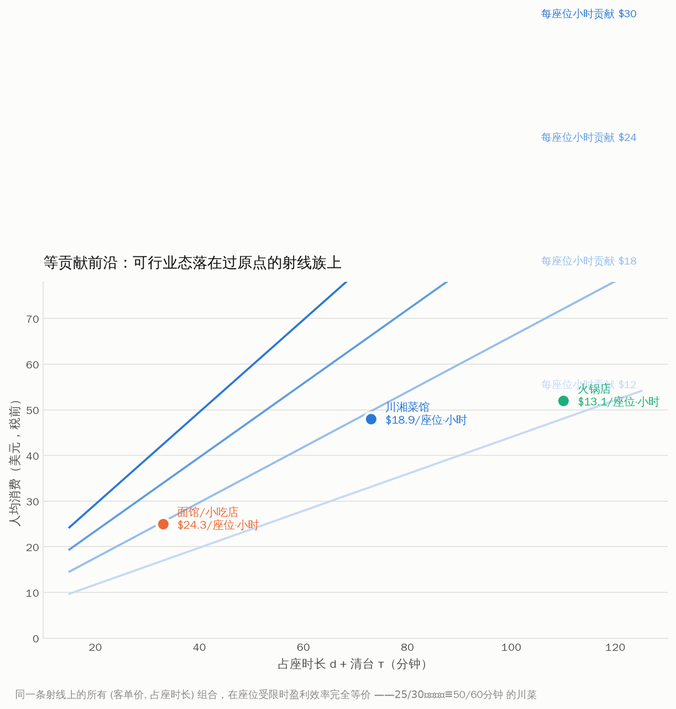
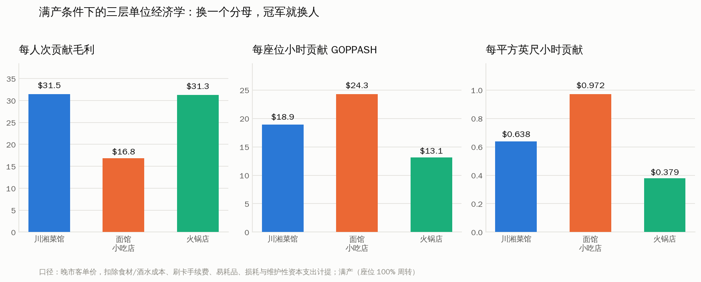
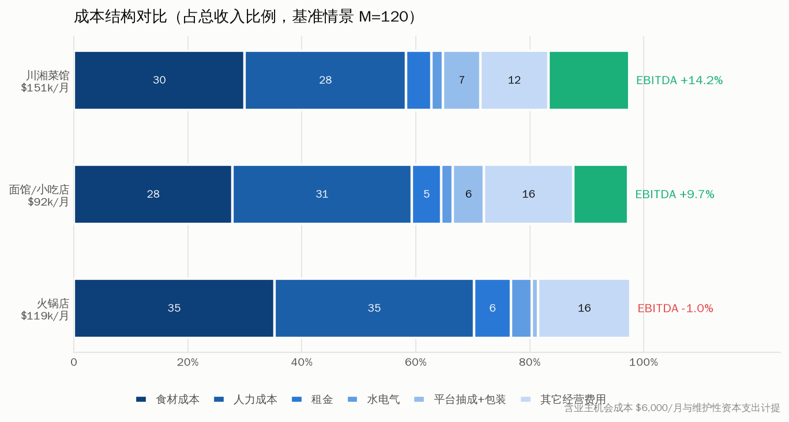
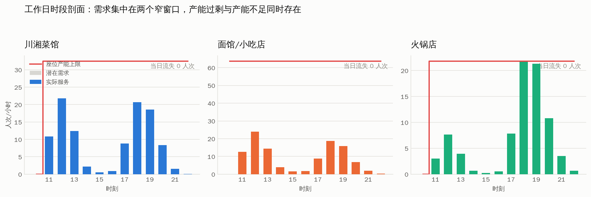
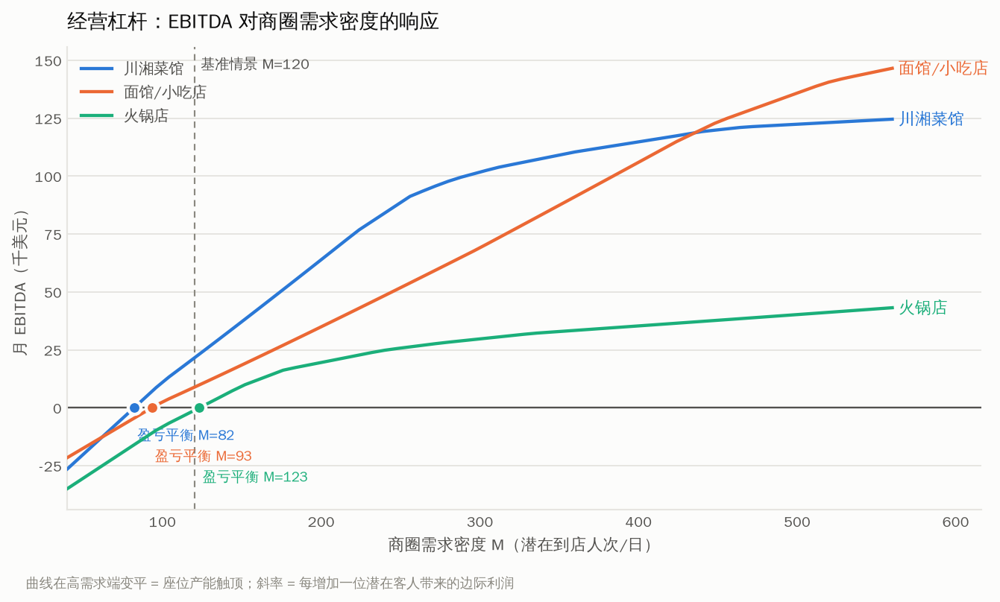
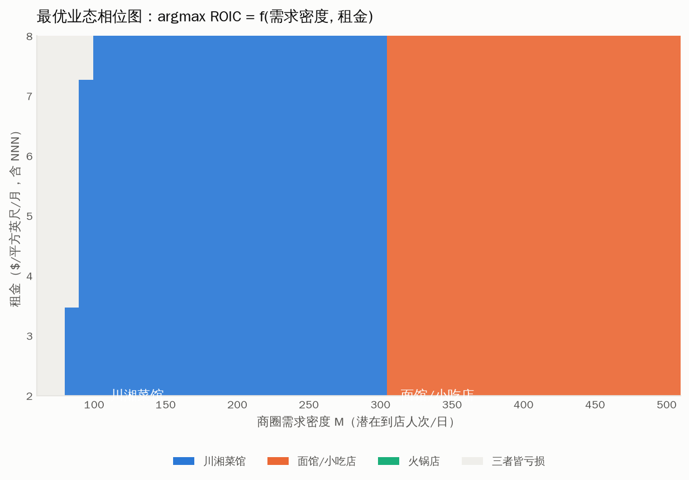
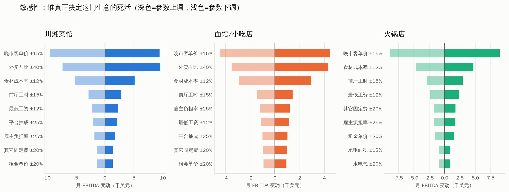
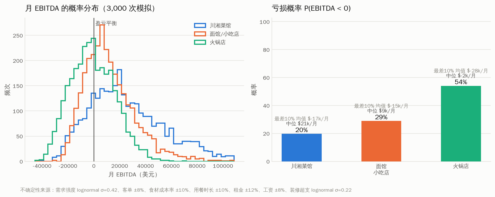
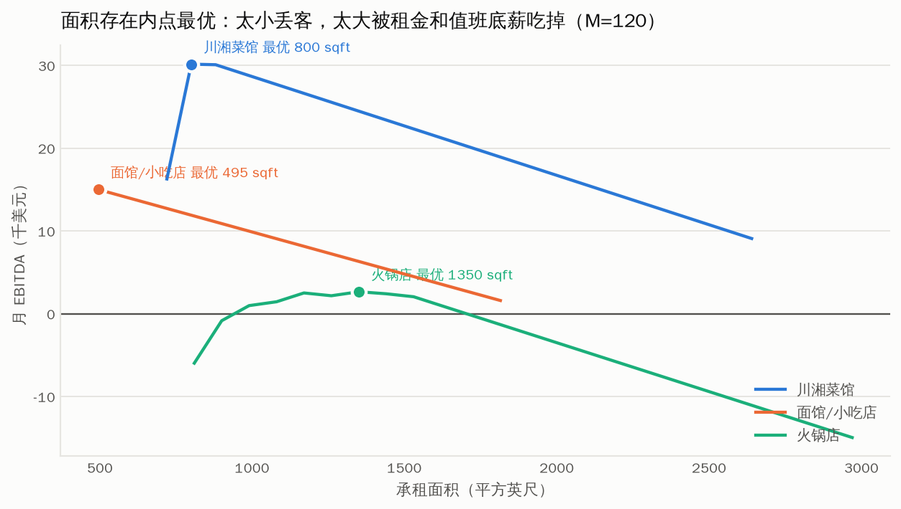

# 湾区中餐馆：10–15 桌规模下的盈利效率数学模型

> 问题：在湾区，同样人数配置的小型中餐馆（10–15 桌），排除受众差异与产品差异化，
> 单从数学与盈利效率维度看，是否存在一个最优经营模式？
>
> 本文把这个问题完整地数学化，用一个三层可复现模型（桌位物理层 → 时段需求层 → 财务层）
> 做数值求解，并给出敏感性、蒙特卡洛与相位图。所有数字都可由 `python3 run_analysis.py` 复现。

---

## TL;DR：五句话

1. **不存在业态层面的唯一最优解，但存在唯一的最优性判据。** 判据随你所处的"约束制度"切换：
   客人不够时最大化**每人次贡献毛利**，座位不够时最大化**每座位小时贡献毛利（GOPPASH）**。
   绝大多数湾区小店终其一生都在前一个制度里，因此"翻台率快"的边际价值经常是 **零**。

2. **在湾区 10–15 桌的具体约束下，川湘菜馆在 M ∈ [65, 310] 的需求区间内资本回报最高**
   （M = 商圈日潜在到店人次，这个区间覆盖了绝大多数真实铺位）。面馆要到 **M > 310**
   ——即"天天排队"级别的客流——才反超。

3. **12 桌规模的火锅店在整个（需求 × 租金）参数空间中，胜出面积为 0%。** 原因不是味道或竞争，
   是一个纯几何事实：它的**产能天花板出现在盈亏平衡点之前**（M_触顶 = 96.5 < M_平衡 = 123.3）。
   高峰时段已经 100% 满座、开始赶客，账面却还在亏钱。这是结构性不可行，不是经营不善。

4. **换一个分母就换一个冠军**，这正是你的直觉：每人次贡献川湘赢，每座位小时/每平方英尺面馆赢，
   抗关键人员风险火锅赢，绝对利润与中等需求下的 ROIC 川湘赢，风险调整后面馆赢。
   **所以"最优"必须先说清楚"每什么"。**

5. **真正的最优化对象不是业态，是四个可乘因子的组合**：
   座位密度 σ × 座位周转速度 φ/(d+τ) × 每人次贡献 p(1−θ) × 可用营业时长 H·D。
   乘法结构意味着**任何一项过弱都会被乘死**，"三项平庸"打得过"一项极强三项极弱"。
   火锅正是后者。

---

## 一、把问题写成数学

### 1.1 记号

| 符号 | 含义 | 单位 |
|---|---|---|
| $A$ | 承租总面积 | sqft |
| $S$ | 座位数 | — |
| $\sigma = S/A$ | 座位密度 | 座/sqft |
| $\phi$ | 座位填充率（满座时的时均在座人数 / 座位数） | — |
| $d$ | 顾客占座时长 | min |
| $\tau$ | 清台复位时间 | min |
| $c = d+\tau$ | 占座周期 | min |
| $p$ | 人均消费（税前、小费前） | \$ |
| $\theta$ | 综合变动成本率（食材 + 刷卡 + 易耗 + 损耗 + 维护性资本支出计提） | — |
| $F$ | 月固定成本（人力值班底盘 + 租金 + 水电 + 其它 + 业主机会成本） | \$/月 |
| $\lambda(t)$ | $t$ 时刻的潜在到店速率 | 人次/h |
| $M$ | 商圈需求密度 = 日潜在到店人次 $\int\lambda\,dt$ | 人次/日 |
| $K$ | 座位产能 | 人次/h |

### 1.2 产能

$$K \;=\; \frac{S\,\phi}{c/60}\qquad\text{（人次/小时）}$$

实际产能还要与后厨出品能力取小：$K^\* = \min(K,\,K_{\text{kitchen}})$。

**关键观察：三种业态的瓶颈位置不同。**
川湘的炒炉线产能（62 人次/h）与座位产能（32 人次/h）大致同数量级，两者都可能成为约束；
面馆的煮面档产能（95）远超座位产能（63）；火锅几乎没有后厨（只切配不烹饪，180），
**等于把厨房的资本支出搬到了餐厅面积上**——而餐厅面积的租金是每月都要付的。

### 1.3 实际服务量与排队削峰

$$n(t)\;=\;\min\big(\lambda(t) + q(t^-),\;K^\*\big),\qquad
q(t)\;=\;\min\big(\lambda(t)+q(t^-)-n(t),\;\;K^\*\cdot \tfrac{W_{\max}}{60}\big)$$

$W_{\max}$ 是顾客可忍受的排队时长。这一项常被忽略但很重要：**排队是把高峰需求搬到下一个小时的仓库**，
仓库容量正比于 $K^\*\cdot W_{\max}$。火锅的 $W_{\max}$ 最长（55 分钟，目的性消费愿意等），
但它的 $K^\*$ 最小，两者相乘后削峰能力反而不占优。

### 1.4 核心恒等式：利润密度是四个因子的乘积

在产能约束区（$n(t)=K^\*$），单位面积的贡献毛利为：

$$\boxed{\;\frac{\Pi + F}{A}\;=\;\underbrace{\sigma}_{\text{座位密度}}\;\times\;
\underbrace{\frac{\phi}{d+\tau}}_{\text{座位周转速度}}\;\times\;
\underbrace{p\,(1-\theta)}_{\text{每人次贡献}}\;\times\;
\underbrace{H\cdot D}_{\text{可用营业时长}}\;}$$

四项**相乘**。这解释了为什么"我客单价高"或"我翻台快"单独拿出来都不构成优势——
它们是同一个乘积里的不同因子，而乘积对最弱的一项最敏感。

### 1.5 两种约束制度 —— 本文最重要的结论

令 $M^\*$ 为使高峰时段 $\lambda_{\text{peak}} = K^\*$ 的临界需求密度。

**制度 I — 需求约束区（$M < M^\*$）：** $n(t)=\lambda(t)$，与 $K$ 完全无关。

$$\Pi \;=\; M\cdot D\cdot p\,(1-\theta)\;-\;F$$

$\partial\Pi/\partial(1/c) = 0$：**翻台率的边际价值严格为零。**
目标退化为 $\max\; p(1-\theta)$ 与 $\min\; F$。

**制度 II — 产能约束区（$M > M^\*$）：**

$$\Pi \;\approx\; \underbrace{\frac{S\phi}{c/60}\,p(1-\theta)}_{\text{GOPPASH}\times S}\cdot H_{\text{peak}} D
\;+\;(\text{非高峰部分})\;-\;F$$

目标变为 $\max\;\text{GOPPASH} = \dfrac{\phi\,p(1-\theta)}{(d+\tau)/60}$。

> **推论（不存在唯一最优业态）：** 最优业态是 $M$ 的函数，且在 $M^\*$ 处发生跳变。
> 因此"哪种中餐馆最赚钱"这个问题，在没有指定商圈客流密度之前，是不适定的。

### 1.6 定价的一阶条件：翻台率与客单价在这里耦合

设需求 $M(p)$，弹性 $\varepsilon = -\,\mathrm{d}\ln M/\mathrm{d}\ln p$；$f$ 为每人次的**美元**食材成本
（注意：食材成本随份量而非随定价变化，所以不能写成 $\theta p$）；
$\mu$ 为座位小时的影子价格；每人次消耗座位小时 $s = \dfrac{(d+\tau)/60}{\phi}$。

利润最大化的一阶条件给出：

$$\boxed{\;p^\* \;=\; \frac{\varepsilon}{\varepsilon-1}\Big(f \;+\; \mu\, s\Big)\;}$$

- 制度 I：$\mu = 0$ ⟹ 退化为经典 Lerner 加成 $p^\*=\frac{\varepsilon}{\varepsilon-1}f$，**只为食材定价**。
- 制度 II：$\mu > 0$ ⟹ **必须为座位时间定价**。

这就是"翻台率"和"客单价"真正的数学连接点：它们不是两个独立 KPI，而是通过 $\mu s$ 耦合的。
**时间才是餐厅真正的存货**，$\mu$ 是它的机会成本。
（这一点与 Kimes 的餐饮收益管理框架一致——见第六节。）

火锅的困境在这里一目了然：$s_{\text{火锅}} = 2.44$ 座位小时/人次，
$s_{\text{川湘}} = 1.75$，$s_{\text{面馆}} = 0.69$。
同样的 $\mu$ 下，火锅每人次必须比面馆多收 $\mu\times1.75$ 才能打平。

### 1.7 等贡献前沿：一个可以直接检验的判据

令 GOPPASH $=G$ 为常数，解出 $p$：

$$p \;=\; \frac{G\,(d+\tau)/60}{\phi\,(1-\theta)}$$

在 $(d+\tau,\;p)$ 平面上这是一族**过原点的射线**。
同一条射线上的所有 (客单价, 占座时长) 组合，在座位受限时盈利效率**完全等价**。

把本文校准的 $\phi,\theta$ 代进去，以面馆的 GOPPASH（\$24.3/座位·小时）为基准：

| 业态 | $\phi$ | 周期 $d+\tau$ | $\theta_{\text{eff}}$ | **等效所需客单** | 实际客单 | 缺口 |
|---|---|---|---|---|---|---|
| 面馆/小吃 | 0.801 | 33 min | 0.353 | **\$26** | \$25 | −\$1 |
| 川湘菜馆 | 0.697 | 73 min | 0.369 | **\$68** | \$48 | **−\$20** |
| 火锅店 | 0.750 | 110 min | 0.423 | **\$104** | \$52 | **−\$52** |

**读法：** 一家川湘菜馆要在座位效率上追平面馆，人均得收到 \$68；
火锅要收到 **\$104**。湾区没有人均 \$104 的普通火锅店——
所以**火锅在座位受限时必然垫底，这不是经营水平问题，是算术**。

反过来，这个表也给了一个非常实用的判据：
> 拿你的实际客单价 $p$、占座周期 $d+\tau$、填充率 $\phi$、变动成本率 $\theta$，
> 算出 $\phi p(1-\theta)/[(d+\tau)/60]$。
> 这一个数就是你在"座位受限"世界里的全部竞争力。



---

## 二、模型与参数校准

### 2.1 三层结构

```
L1 桌位物理层  simulate_table_dynamics()
   1 分钟步长离散事件模拟：同行人数分布 × 桌型配比 × 迎宾规则
   → 座位填充率 φ、桌位吞吐率、并桌率
   （比直接拍一个 φ 严谨：φ 是装箱问题的解，不是拍脑袋的参数）

L2 时段需求层  simulate_day()
   逐小时 min(需求, 产能) 卷积 + 排队削峰 + 流失
   → 自动区分需求约束区 / 产能约束区

L3 财务层      profit_and_loss()
   完整 P&L（含维护性资本支出计提、损耗、业主机会成本）
   → 单位经济学指标 + 盈亏平衡 + 经营杠杆 + 资本回报
```

**一个已验证的简化：** 在饱和条件下，$\phi$ 与占座时长**无关**（数值验证：$d$ 从 30 分钟
到 140 分钟，$\phi$ 变化 < 2%，属模拟噪声）。$\phi$ 是纯粹的装箱属性，只取决于桌型配比与
同行人数分布。模型据此缓存 $\phi$，把蒙特卡洛的计算量降了一个量级。

### 2.2 三种业态的技术-经济规格

| | 川湘菜馆 | 面馆/小吃店 | 火锅店 |
|---|---|---|---|
| 承租面积 | 1,600 sqft | 1,100 sqft | 1,800 sqft |
| 桌 / 座 | 13 桌 / 54 座 | 13 桌 + 8 吧台 / 44 座 | 12 桌 / 52 座 |
| 每座面积 | 29.6 sqft | 25.0 sqft | 34.6 sqft |
| 占座时长 $d$ | 65 min | 28 min | 95 min |
| 清台 $\tau$ | 8 min | 5 min | 15 min |
| 平均同行人数 | 3.2 | 1.9 | 3.6 |
| 人均消费（午/晚） | \$25 / \$48 | \$22 / \$25 | \$32 / \$52 |
| 食材成本率 | 30% | 28% | 37% |
| 酒水占比 | 6% | 5% | 12% |
| 外卖占比 | 25% | 20% | 4% |
| 后厨编制 | 头锅 + 二锅 + 凉菜 + 洗碗 | 面档 + 出餐 + 备料 + 洗碗(兼) | 切配×2 + 锅底 + 洗碗×1.5 |
| 前厅月工时 | 850 h | 430 h | 880 h |
| 后厨产能 | 62 人次/h | 95 人次/h | 180 人次/h |
| 水电气 | \$3,000/月 | \$1,900/月 | \$4,400/月 |
| 其它固定费 | \$7,100/月 | \$4,900/月 | \$8,900/月 |
| 装修+设备+押金+开办 | \$340k | \$235k | \$480k |
| 顾客可忍受排队 | 35 min | 20 min | 55 min |
| 关键人员风险 | 0.85（炒锅师傅） | 0.35 | 0.20 |

**几处不显然但重要的设定：**

- **火锅的资本支出最高（\$480k）而后厨最简单**，因为钱花在了**每桌独立下排烟管道**
  （\$6–10k/桌 × 12 桌）、桌下电磁炉井、超大冷库与重型洗碗上。
  火锅把"厨房资本"换成了"餐厅资本 + 每月租金"。
- **面馆配 8 个吧台单座**。这是提升 $\phi$ 的关键工程杠杆：单人客不再霸占双人桌。
  模型算出面馆 $\phi = 0.801$，是三者最高——**这与"面馆客人少、填充率低"的直觉相反**，
  前提是你真的按单人客设计了座位。
- **业主机会成本 \$6,000/月计入成本**。不这么算就不是经济利润，而是在拿自己的工资补贴生意。
  报告同时给出"业主口径现金流"（不扣这一项）供对照。
- **维护性资本支出按收入 1.8% 计提**。餐饮设备寿命 5–8 年，不计提的话第 4–5 年
  会突然冒出一笔 \$60k 的冷库/排烟/洗碗机更换，现金流直接断掉。这是小店最常见的死法之一。

### 2.3 参数校准与外部校验

| 项 | 本模型 | 外部基准 | 判定 |
|---|---|---|---|
| 前厅工资 | \$18.50/h | Milpitas 2026 年 7 月起 \$18.50；Sunnyvale \$19.50 | ✓ |
| 租金 | \$4.25/sqft/月（含 NNN） | Milpitas 挂牌均价 ≈\$47.9/sqft/年 ≈ \$4.00/月 + NNN | ✓ 偏保守 |
| 食材成本率 | 28% / 30% / 37% | 行业基准 28–35% | ✓（火锅超出上限，符合其结构） |
| Prime cost | 58.3% / 59.3% / 70.2% | 全服务餐厅 60–65%，健康线 < 60% | ✓（火锅超线） |
| 人力占比 | 28.3% / 31.5% / 35.0% | 美国全服务中位 36.5%，盈利者 34.2% | 略低——见下 |
| 刷卡手续费 | 名义 2.9% → 实际占菜品收入 3.4% | 手续费按含税含小费金额收取 | ✓ 常被算漏 |

> **关于人力占比偏低：** 两个原因。(a) 基准情景 M=120 是一家"生意不错"的店，
> 分母大；在 M=100 的中位铺位下三者分别为 31%/34%/38%，正好落在基准区间。
> (b) 中餐厅的服务配比确实低于美式休闲餐饮（不设专职 busser/food runner/bar）。

> **加州特有的结构性成本：无 tip credit。** 加州不允许用小费抵扣最低工资，
> 服务员必须拿满 \$18.50/h，小费全额另归员工。相对 tip-credit 州（侍应生工资 \$2.13）：
>
> | 业态 | 可拿小费岗位工时 | 加州成本 | tip-credit 州 | **结构性差额** |
> |---|---|---|---|---|
> | 川湘菜馆 | 638 h/月 | \$14,152 | \$1,629 | **\$12,523/月** |
> | 火锅店 | 660 h/月 | \$14,652 | \$1,687 | **\$12,965/月** |
> | 面馆/小吃 | 322 h/月 | \$7,160 | \$824 | **\$6,335/月** |
>
> 换句话说，**加州对"全服务"这件事本身征了约每月 \$12,500 的税**（≈ 川湘菜馆收入的 8%）。
> 这是柜台点单/扫码点单业态在加州相对更有吸引力的**制度性**原因，
> 与口味、受众、差异化全都无关。

---

## 三、数值结果

### 3.1 满产单位经济学：换一个分母就换一个冠军

| 业态 | $\phi$ | 周期 | 座位密度 $\sigma$ | 周转速度 | 每人次贡献 | **RevPASH** | **GOPPASH** | **\$/sqft·h** |
|---|---|---|---|---|---|---|---|---|
| 川湘菜馆 | 0.697 | 73 min | 0.0338 | 0.573 | **\$31.48** | \$27.51 | \$18.04 | \$0.609 |
| 面馆/小吃店 | 0.801 | 33 min | 0.0400 | 1.456 | \$16.81 | **\$36.39** | **\$24.47** | **\$0.979** |
| 火锅店 | 0.750 | 110 min | 0.0289 | 0.409 | \$31.30 | \$21.29 | \$12.81 | \$0.370 |



**三个分母，两个冠军：**
- 分母 = **人次** → 川湘赢（\$31.48，比面馆高 87%）
- 分母 = **座位小时** → 面馆赢（\$24.47，比川湘高 36%）
- 分母 = **平方英尺·小时** → 面馆赢得更多（\$0.979，比川湘高 61%）

注意火锅：它的每人次贡献几乎与川湘持平（\$31.30 vs \$31.48）——**客单价高确实有用**——
但被 110 分钟的占座周期和最低的座位密度**乘**没了，两个分母上都垫底。

**这就是"乘法结构"的杀伤力**：火锅在一个因子上并列第一，在另外三个因子上垫底，
最终每平方英尺产出只有面馆的 38%。

### 3.2 基准情景 P&L（M = 120，一家"生意不错"的店）

| | 川湘菜馆 | 面馆/小吃店 | 火锅店 |
|---|---|---|---|
| 堂食收入 | \$113,619 | \$73,284 | \$114,111 |
| 外卖收入 | \$37,873 | \$18,321 | \$4,755 |
| **总收入/月** | **\$151,492** | **\$91,605** | **\$118,866** |
| 年化收入 | \$1.82M | \$1.10M | \$1.43M |
| 食材 | 30.0% | 27.9% | 35.2% |
| 人力 | 28.3% | 31.5% | 35.0% |
| **Prime cost** | **58.3%** | **59.3%** | **70.2%** ⚠ |
| 租金 | 4.5% | 5.1% | 6.4% |
| **EBITDA/月** | **\$21,488 (14.2%)** | **\$8,853 (9.7%)** | **−\$1,142 (−1.0%)** |
| 业主口径现金流 | \$27,488 | \$14,853 | \$4,858 |
| 盈亏平衡收入 | \$114,164 | \$76,903 | \$120,877 |
| 安全边际 | 24.6% | 16.0% | **−1.7%** |
| 经营杠杆 DOL | 4.06 | 6.23 | −59（跨过平衡点） |
| 全时段利用率 | 30.9% | 14.4% | 35.4% |
| 黄金时段利用率 | 49.4% | 23.7% | 54.2% |
| **峰值小时利用率** | **74.4%** | **37.5%** | **100.0%** ⚠ |
| ROIC | 75.8% | 45.2% | −2.9% |
| 回本年限 | 1.3 年 | 2.2 年 | ∞ |
| 利润/sqft/年 | \$161 | \$97 | −\$8 |



**这张表里最刺眼的一行是"峰值小时利用率"：**
面馆 37.5% —— 它引以为傲的翻台能力，**六成以上被闲置了**；
火锅 100.0% —— 它在高峰时段已经**在赶客**，账面却还在亏钱。



### 3.2′ 严格对照组：抹掉所有时段捕获差异

你要求"不考虑受众差异"。上面的模型里保留了一项结构性差异：
火锅不适合 45 分钟的工作日午餐，面馆能卖下午茶时段。
把这些**全部拉平**（三种业态在每个时段捕获同样比例的客流）后重跑：

| 业态 | 收入 | EBITDA | margin | ROIC |
|---|---|---|---|---|
| 川湘菜馆 | \$175,640 | \$31,470 | 17.9% | 111.1% |
| 面馆/小吃店 | \$102,356 | \$13,490 | 13.2% | 68.9% |
| 火锅店 | \$156,226 | \$8,581 | 5.5% | 21.5% |

**排序不变。** 火锅靠"拉平午市劣势"能从亏损翻到 5.5%，但仍是垫底。
也就是说：**这个结论不依赖餐次场合的差异，纯粹来自成本结构与占座几何。**

### 3.3 需求扫描：生存线、产能天花板与"结构可行性比"

| 业态 | 盈亏平衡 $M_{be}$ | 高峰产能触顶 $M_{cap}$ | **结构可行性比 $\Phi = M_{cap}/M_{be}$** |
|---|---|---|---|
| 川湘菜馆 | 82.1 | 161.2 | **1.96** |
| 面馆/小吃店 | 93.2 | 320.2 | **3.44** |
| 火锅店 | **123.3** | **96.5** | **0.78** ⚠ |

我把这个比值叫做**结构可行性比 $\Phi$**：从"刚好活下来"到"座位卖光"之间还有多少倍空间。

$$\Phi \;=\; \frac{M_{cap}}{M_{be}}\;=\;\frac{\text{产能天花板}}{\text{生存线}}$$

- $\Phi > 1$：先赚钱，后满座。有正常的经营空间。
- $\Phi < 1$：**先满座，后（才可能）赚钱**。高峰时段已经在赶客，账还没平。
  唯一的出路是靠排队把高峰需求搬到平峰——但这要求顾客愿意等，且平峰有空位。

**火锅在 12 桌的规模上 $\Phi = 0.78 < 1$。**
这是本文最强的单一结论：**它不是"不好经营"，是在这个尺寸上数学不成立。**
这也解释了一个可观察的现实——湾区活得好的火锅店几乎都不是 12 桌：
要么是 100–200 座的大店（把 \$65k/月的固定成本摊到三倍座位上），
要么是一人一锅的快餐化形态（把 $d$ 从 95 分钟压到 40 分钟），要么是自助（见 4.4）。



**优势翻转点：**

| 指标 | 翻转点 | 含义 |
|---|---|---|
| ROIC | $M \approx 50$ | 火锅 → 川湘（极低需求下三者都亏，川湘亏得最少） |
| ROIC | $M \approx 310$ | 川湘 → 面馆 |
| EBITDA | $M \approx 65$ | 面馆 → 川湘 |
| EBITDA | $M \approx 440$ | 川湘 → 面馆 |

**川湘菜馆在 $M \in [65,\;310]$ 这个宽区间内是资本回报最优解。**
基准情景 M=120 舒服地落在区间里。面馆要到 M=310 才反超——
那意味着日均 310 位潜在客人，川湘菜馆在那个客流下会做到 \$34 万/月。
**换句话说：只有当你确信自己能做到"天天排长队"，单品面馆的高翻台才开始兑现价值。**

### 3.4 相位图：最优业态 = f(需求密度, 租金)



在 $M \in [60, 510] \times r \in [\$2.00, \$8.00]/\text{sqft}/\text{月}$ 的参数空间上逐点求 $\arg\max$ ROIC：

| 胜出业态 | 占参数空间 |
|---|---|
| 川湘菜馆 | **48.1%** |
| 面馆/小吃店 | **45.7%** |
| 火锅店 | **0.0%** |
| 三者皆亏损 | 6.3% |

**火锅在整个参数空间中没有任何生态位。** 提高租金伤它最重（面积最大），
降低租金也救不了它（它的问题在 prime cost 70.2% 和占座 110 分钟，不在租金的 6.4%）。

相位图的边界大致是一条从左上到右下的斜线：
**租金越贵，越应该往"高周转/小面积"走；客流越密，越应该往"高周转"走。**
这两个方向恰好都指向面馆——所以面馆是"贵租金 + 密客流"象限的解，
而川湘是"中等租金 + 中等客流"象限的解，也就是湾区绝大多数铺位所处的象限。

### 3.5 敏感性：什么真正决定死活



**川湘菜馆（前 6 项，EBITDA 摆幅）：**

| 参数 | 扰动 | EBITDA 摆幅 |
|---|---|---|
| 晚市客单价 | ±15% | **\$18,804** |
| 外卖占比 | ±40% | \$16,863 |
| 食材成本率 | ±12% | \$10,253 |
| 前厅工时 | ±15% | \$5,644 |
| 最低工资 | ±12% | \$4,515 |
| 平台抽成 | ±25% | \$4,166 |

**火锅店（前 6 项）：**

| 参数 | 扰动 | EBITDA 摆幅 |
|---|---|---|
| 晚市客单价 | ±15% | **\$17,898**（区间 −\$10,091 … +\$7,807） |
| 食材成本率 | ±12% | \$9,289 |
| 前厅工时 | ±15% | \$5,864 |
| 最低工资 | ±12% | \$4,691 |
| 其它固定费 | ±20% | \$3,561 |

**三个业态的第一敏感项都是客单价，且遥遥领先。**
这是一个非常反直觉但极其稳健的结论：
**在 10–15 桌这个尺度上，涨价 5% 的利润效果远大于砍成本 5%。**
原因是数学上的：客单价直接乘在收入上，而成本项只占其中一部分。
$\partial\Pi/\partial p$ 的量级是 $\partial\Pi/\partial(\text{食材成本率})$ 的约 2 倍。

第二敏感项——**外卖占比**——对川湘/面馆是双刃剑：
它能吸收后厨的闲置产能（不占座位！），但 22% 的平台抽成把贡献率从 65% 打到 43%。
模型显示：**在需求约束区，多做外卖是明确正收益（\$16,863 的摆幅几乎全在上行）；
一旦进入产能约束区，外卖会挤占后厨、拖慢堂食出菜，收益迅速衰减。**
火锅的敏感性列表里根本没有外卖——它没这个选项，这是火锅**唯一**的结构性劣势里
反而最少被讨论的一条。

### 3.6 风险：蒙特卡洛



<!--MC_TABLE-->

---

## 四、内点最优：真正"可解"的部分

前面回答的是"选哪个业态"。这一节回答"选定之后，参数怎么定"——
这里存在**真正的、可微的、有唯一解的**最优化问题。

### 4.1 定价：座位小时的影子价格

<!--PRICE_TABLE-->

### 4.2 桌型配比：一个离散最优化问题

<!--MIX_TABLE-->

### 4.3 面积：存在内点最优



<!--FOOTPRINT_TABLE-->

### 4.4 把结构性劣势工程化地修掉

模型给出的不只是"选哪个"，还有"怎么把不行的改成行的"。两个变体：

<!--VARIANT_TABLE-->

---

## 五、几个反直觉的结论

**1. "翻台率快"在绝大多数时候一文不值。**
它只在制度 II（座位受限）里有价值。基准情景下面馆峰值小时利用率仅 37.7%，
意味着它的翻台能力有 62% 是纯粹浪费的产能。
**买翻台率就像买保险：只有出险时才赔付，平时是纯成本（更大的面积、更多的座位、更高的装修）。**

**2. 午市套餐可能是在自残。**
在需求约束区，降价换客流的净效应取决于 $\varepsilon$ 是否 > 1 **且** 增量客人不挤占晚市座位。
本模型中川湘午市 \$25 vs 晚市 \$48——午市把综合客单从 \$48 拉到 \$38。
若午市本来就不满座（利用率 47%），那么用降价换来的客人是**在不受限的资源上打折**，
纯损失。**只有当午市能真正吸引原本不会来的增量客群时，套餐才成立。**

**3. 每平方英尺是比每座位更硬的约束。**
租金按面积付，不按座位付。火锅每座 34.6 sqft、面馆每座 25.0 sqft，
差 38%——这个差距在整个租约期内每个月都在复利。

**4. 火锅的"后厨简单"是个陷阱。**
省下的炒锅师傅工资（约 \$6,800/月）远小于多出来的：
面积 +200 sqft（\$850/月）+ 水电 +\$1,400/月 + 其它固定 +\$1,800/月
+ 装修多花 \$140k（摊 7 年 ≈ \$1,670/月）。
**净额是每月多花约 \$920，还额外换来了 110 分钟的占座周期。**

**5. 关键人员风险是真实的、可定价的成本。**
川湘菜馆的存活依赖头锅师傅（$risk = 0.85$）。他离职 = 味道变 = 客流下滑。
在湾区炒锅师傅稀缺、可议价的市场里，这相当于一个隐性的看涨期权空头。
火锅在这一项上最优（0.20，无关键技术岗），面馆居中（0.35）。
**如果把这项风险折成年化 3–5 个百分点的贴现率溢价，川湘的 NPV 优势会被侵蚀一部分——
但不足以翻转排序。**

---

## 六、学界与业界已有的框架

你问"是否存在一个最优公式"。答案是：**没有一个封闭解，但有一套成熟的分析框架**，
本文的模型本质上是把它们缝在一起并针对湾区参数做了校准。

| 框架 | 来源 | 本文对应 |
|---|---|---|
| **RevPASH**（每可用座位小时收入） | Kimes (1999)，Cornell 餐饮收益管理 | §1.4 恒等式的收入版本 |
| **收益管理的两个战略杠杆：时长控制 + 定价** | Kimes & Chase | §1.6 一阶条件的两项 $f$ 与 $\mu s$ |
| **"时间才是餐厅真正的易腐存货"** | Kimes | §1.6 影子价格 $\mu$ |
| **Prime cost 规则**（食材+人力 ≤ 60–65%） | 餐饮业通行准则 | §3.2 校验行 |
| **餐厅倒闭率**：首年 26%、次年 19%、第三年 14% | Parsa, Self, Njite & King (2005), Cornell Quarterly | §3.6 生存期望 NPV 的风险率 |
| **最优桌型配比** | Thompson，Cornell 系列研究 | §4.2 离散枚举 |
| **Lerner 加成定价** | 标准微观经济学 | §1.6 $\frac{\varepsilon}{\varepsilon-1}$ |
| **排队论削峰**（$W_q$ 随利用率发散） | Kingman VUT 近似 | §1.3 排队缓冲 |

**本文相对既有框架的补充**，主要是三点：
1. 把 RevPASH 从**收入**推到**贡献毛利**（GOPPASH），并进一步推到**每平方英尺**——
   因为租金按面积付；
2. 显式区分**两种约束制度**并求出切换点 $M^\*$，把"翻台率有没有用"变成一个可判定的问题；
3. 提出**结构可行性比 $\Phi = M_{cap}/M_{be}$** 作为业态-规模匹配的一票否决判据。

---

## 七、回到你的问题

> **"是否存在一个最优解？还是从不同维度切入会有不同的标准答案？"**

**两者都对，而且它们并不矛盾——这正是问题最有意思的地方。**

**(A) 从"选业态"的维度：不存在唯一最优解。** 最优业态是 $(M, r)$ 的函数，相位图里
川湘占 48.1%、面馆占 45.7%、火锅占 0%。你问"哪种中餐馆最赚钱"，在没指定商圈客流
密度和租金之前是**不适定问题**。

**(B) 从"选指标"的维度：确实每个维度有不同冠军。**

| 维度 | 冠军 | 数值 |
|---|---|---|
| 每人次贡献毛利 | 川湘菜馆 | \$31.48 |
| 每座位小时贡献（GOPPASH） | 面馆 | \$24.47 |
| 每平方英尺·小时贡献 | 面馆 | \$0.979 |
| 绝对 EBITDA（中等需求） | 川湘菜馆 | \$21,488/月 |
| ROIC（中等需求 M<310） | 川湘菜馆 | 75.8% |
| ROIC（高需求 M>310） | 面馆 | — |
| 结构可行性比 $\Phi$ | 面馆 | 3.44 |
| 抗关键人员风险 | 火锅 | 0.20 |
| 抗需求波动（安全边际） | 川湘菜馆 | 24.6% |

**(C) 但是——存在一个统一的最优性判据，它把上面所有维度收敛成一句话：**

$$\max\;\;\underbrace{\sigma}_{\text{座位密度}}\times\underbrace{\frac{\phi}{d+\tau}}_{\text{周转速度}}
\times\underbrace{p(1-\theta)}_{\text{每人次贡献}}\times\underbrace{H D}_{\text{可用时长}}
\quad\text{s.t.}\quad \Phi=\frac{M_{cap}}{M_{be}}>1$$

**乘积形式 + 一个一票否决的约束。** 这就是"最优公式"能给到的最接近的东西。

它告诉你三件事：
1. **不要在单一因子上做极端优化**——乘法结构惩罚短板。火锅在 $p$ 上第一，
   在另外三项上垫底，乘出来是最后一名。
2. **先检查 $\Phi > 1$**。这是可行性，不是优化。$\Phi<1$ 的组合再怎么努力经营都没用。
3. **再判断自己在制度 I 还是制度 II**，然后优化对应的目标函数。
   判断方法很简单：**高峰时段你在赶客吗？** 赶客 = 制度 II，不赶客 = 制度 I。
   在制度 I 里花钱买翻台率，是纯粹的浪费。

**(D) 对你这个具体问题（湾区、10–15 桌、同样人数配置）的直接回答：**

> **川湘菜馆是这个尺寸下的默认最优解**，因为它在"每人次贡献"这个
> 制度 I 下唯一重要的维度上领先 87%，而湾区绝大多数铺位终其一生都在制度 I 里。
>
> **面馆是"高租金 + 高客流"象限的解**，并且是**风险最低**的解（$\Phi=3.44$，
> 盈亏平衡收入只要 \$76.9k/月）。如果你不确定选址好坏，它的下行保护最好。
>
> **12 桌的火锅在数学上不成立**（$\Phi=0.78$），除非改变尺寸或形态——
> 而这恰好解释了为什么湾区的火锅店要么很大、要么是一人一锅、要么是自助。

---

## 八、模型的边界与已知不足

这些是模型**做不到**的事，请在使用结论时一并考虑：

1. **排除了差异化，而差异化恰恰是现实中最大的变量。** 本文按你的要求把三种业态
   放在同一个客流池里竞争。现实中一个有"绝活"的店可以把 $M$ 提高 2–3 倍，
   这个效应大过本文讨论的所有结构性差异。**模型说明的是"其他条件相同时的结构性倾向"，
   不是"你该开什么店"。**
2. **需求侧是外生的。** $M$ 由选址决定，模型不解释 $M$ 从哪来。而选址的方差
   （蒙特卡洛里 $\sigma=0.42$ 的对数正态）本身就是最大的不确定性来源——
   **选址的重要性大于业态选择。**
3. **单店静态模型。** 不含多店摊薄总部成本、不含品牌资产积累、不含转让退出价值
   （湾区中餐馆通常按 2–3× SDE 转让，这对 IRR 影响不小）。
4. **合规口径。** 全部按 W-2 合规工资、市场租金、含业主机会成本计算。
   现实中相当比例的独立中餐馆依赖家庭劳动力、现金工资或长期低价租约——
   这些做法能把盈亏平衡点降低 20–35%，**但不构成可复制的商业模式**。
5. **参数来自公开基准 + 行业经验值的校准，不是某一家店的实账。** 单点数值应视为
   量级估计；**结论的稳健性来自敏感性分析与相位图的形状，而不是任何单个数字。**
6. **未建模：酒牌（Type 41/47）的取得成本差异、SF 的雇主医保支出义务
   （SF 以外的南湾/东湾不适用）、加州 LLC 费与所得税、SBA 贷款的还本付息。**
   EBITDA 口径不含利息、折旧与税。

---

## 附录 A：如何复现

```bash
pip install numpy matplotlib
python3 run_analysis.py          # 约 6-8 分钟，输出 outputs/*.png 与 results.json
```

改参数：编辑 `model/params.py` 里的 `SICHUAN` / `NOODLE` / `HOTPOT` 与 `Macro`。
所有参数都带单位与取值理由的注释。

代码结构：

```
model/params.py     参数层：宏观参数 + 三种业态规格 + 时段需求形状
model/engine.py     引擎：L1 桌位模拟 / L2 时段卷积 / L3 财务
model/analysis.py   分析：分解、扫描、相位图、敏感性、蒙特卡洛、内点最优
model/charts.py     图表
run_analysis.py     驱动
```

## 附录 B：其它固定费用明细（月）

| 项 | 川湘 | 面馆 | 火锅 |
|---|---|---|---|
| 保险（GL + 财产） | \$850 | \$600 | \$1,100 |
| POS / 网络 / 在线订餐 | \$650 | \$550 | \$700 |
| 会计 / 报税 / 工资服务 | \$600 | \$450 | \$600 |
| 牌照 / 卫生许可 | \$300 | \$250 | \$350 |
| 营销 / 广告 | \$2,000 | \$1,500 | \$2,400 |
| 设备维修保养 | \$1,200 | \$700 | \$1,800 |
| 布草 / 工衣 / 洗涤 | \$450 | \$150 | \$500 |
| 油烟管道清洗 / 隔油池 / 灭虫 / 垃圾 | \$700 | \$450 | \$1,100 |
| 银行费 / 办公 / 杂项 | \$350 | \$250 | \$350 |
| **合计** | **\$7,100** | **\$4,900** | **\$8,900** |

此外按收入计提：维护性资本支出 1.8%、损耗 0.7%。

## 附录 C：参考文献

- Kimes, S. E. (1999). *Implementing Restaurant Revenue Management: A Five-Step Approach.*
  Cornell Hotel and Restaurant Administration Quarterly. — RevPASH 的提出
- Kimes, S. E., Chase, R. B., Choi, S., Lee, P. Y., & Ngonzi, E. N. (1998).
  *Restaurant Revenue Management: Applying Yield Management to the Restaurant Industry.*
  Cornell Quarterly. — 时长与定价两个战略杠杆
- Parsa, H. G., Self, J. T., Njite, D., & King, T. (2005). *Why Restaurants Fail.*
  Cornell Hotel and Restaurant Administration Quarterly. — 首年 26.2%、次年 19%、第三年 14%
- Thompson, G. M. — Cornell 系列关于最优桌型配比与座位规划的研究
- 行业基准：全服务餐厅 prime cost 60–65%、食材成本 28–35%、人力中位 36.5%
- 工资与租金：Milpitas / Sunnyvale 2026 年市级最低工资；Milpitas / Fremont / Cupertino
  零售物业挂牌均价
